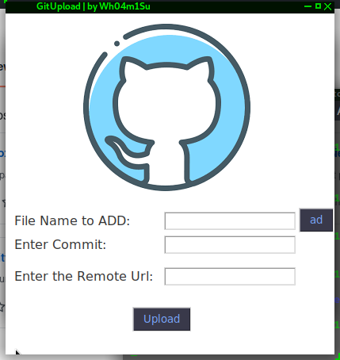

# GitUpload
Python Script +  Tkinter Graph whit send Projects of the Github

# Screenshots

# Instalacion & Ejecucion
1-Primero tienen que copiar el archivo que decen subir a la carpeta temp    
2-Luego ejecutar el script: python3 gitupload.py   
3-abrir github en su navegador y darle en nuevo repositorio crean el repositorio y luego vuelven a la app    

4-rellenen los datos de la app para a;adir archivos para
subir deven poner el archivo darle en el boton add  borrar lo escrito en el entry y lo mismo con  
todos los archivos que vallais a subir  

5-Disfruten de la App

# Contactos
<a href="https://t.me/wh04m1su">Telegram</a>
